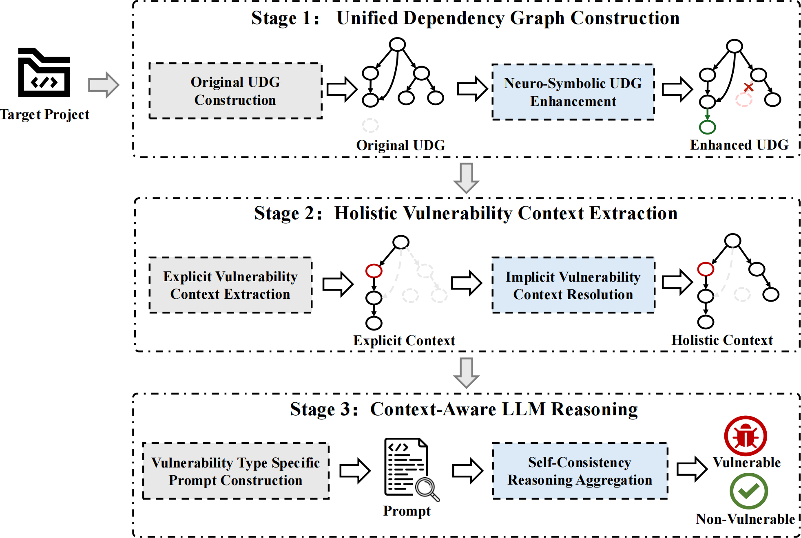
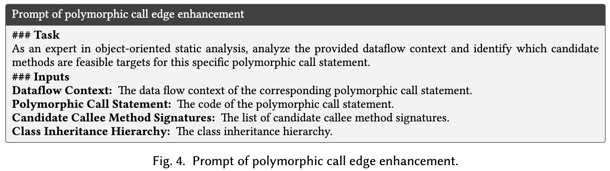

# VulWeaver: Weaving Broken Semantics for Grounded Vulnerability Detection
---

[](LICENSE)
[](https://kernel.org/)
## Overview



Detecting vulnerabilities in source code remains critical yet challenging, as conventional static analysis tools construct inaccurate program representations, while existing LLM-based approaches often miss essential vulnerability context and lack grounded reasoning. In this paper, we introduce VulWeaver, a novel LLM-based approach that weaves broken program semantics into accurate representations and extracts holistic vulnerability context for grounded vulnerability detection. VulWeaver first constructs an enhanced unified dependency graph (UDG) by integrating deterministic rules with LLM-based semantic inference to address static analysis inaccuracies. It then extracts holistic vulnerability context by combining explicit contexts from program slicing with implicit contexts, including usage, definition, and declaration information. Finally, VulWeaver employs meta-prompting with vulnerability type specific expert guidelines to steer LLMs through systematic reasoning, aggregated via majority voting for robustness. Extensive experiments on the extended CrossVul dataset show that VulWeaver achieves a precision of 0.84, recall of 0.69, and F1-score of 0.75, outperforming state-of-the-art learning-based, LLM-based, and agent-based baselines by 23%, 14%, and 53% in F1-score, respectively. Notably, VulWeaver attains a VP-S score of 0.56, 167% higher than the best baseline, confirming its strong discriminative power in distinguishing vulnerable code from patched counterparts. VulWeaver also demonstrates cross-language generalizability on the C/C++ PrimeVul dataset with minimal adaptation, achieving an F1-score of 0.78. For practical usefulness, VulWeaver detected 26 true vulnerabilities across 9 real-world Java projects, with 15 confirmed by developers and 5 CVE identifiers assigned. In industrial deployment, VulWeaver identified 4 confirmed vulnerabilities in an internal repository.


## 🗂️ Project Structure Overview

| Folder                      | Description                                            |
| --------------------------- | -----------------------------------------------------  |
| [prototype](./src/)         | 🧩 Main VulWeaver detection implementation              |
| [fig](./fig/)               | 🖼️ Key figures used in the paper.                       |
| [baselines](./baselines/)   | 🛠️ Baseline method implementations                      |
| [evaluation](./evaluation/) | 📊 Detailed experimental data for all RQs in the paper. |

## 📜 Project Structure                      
```
VulWeaver/
├── src/                # 🧩 Main VulWeaver detection implementation
│   ├── VulWeaver.py             # Main entry point
│   ├── Constructing_Enhanced_UDG/    # UDG construction & LLM-based enhancement
│   ├── Holistic_Context_Extraction/  # Program slicing & context extraction
│   ├── Context-Aware_LLM_Reasoning/  # Meta-prompting & grounded reasoning
├── baselines/           # 🛠️ Baseline method implementations
│   ├── agent-based     # Multi-agent approaches (VulTrial)
|   ├── learning-based  # GNN-based approaches (DeepDFA)
|   ├── LLM-based       # LLM-based approaches (LLMxCPG,VulInstruct,CoT)
├── evaluation/       # 📊 Detailed experimental data for all RQs in the paper.
│   ├── RQ1 # RQ1: Effectiveness evaluation on extended crossvul dataset
│   ├── RQ2 # RQ2: Ablation study
│   └── RQ3 # RQ3: Parameter Sensitivity
│   └── RQ4 # RQ4: Generality evaluation on C/C++ PrimeVul dataset
│   └── RQ5 # RQ5: Efficiency Evaluation
│   └── RQ6 # RQ6: Usefulness Evaluation
│   └── RQ7 # RQ7: UDG Enhancement Evaluation 
```
## 🚀 Getting Start
### 🛠️ Requirements
- **python**: 3.11.8

- **joern**: 2.260

  The installation process for Joern can be found at https://docs.joern.io/installation.

- **tree-sitter**: 0.22.6

  The installation process for tree-sitter can be found at https://tree-sitter.github.io/tree-sitter/

- Other relevant dependent packages listed in [requirements.txt](requirements.txt)

### ⚙️ Prerequisites (Conda & Environment Variables)

Before running any sample, set up a conda environment and export the required environment variables.

**1. Create and activate a conda environment**

```bash
# Create environment with Python 3.11.8
conda create -n vulweaver python=3.11.8 -y

# Activate the environment
conda activate vulweaver

# Install dependencies from project root
cd VulWeaver
pip install -r requirements.txt
```

**2. Export required environment variables**

```bash
# Path to Joern CLI (required for CPG/UDG construction)
export JOERN_PATH="/path/to/joern-cli"

# DeepSeek API key (required for LLM-based call graph enhancement and reasoning)
export DEEPSEEK_API_KEY="YOUR_DEEPSEEK_API_KEY"
```

### ▶️ Running Sample
#### 1. Constructing Enhanced UDG
- **Core Logic**: Integrates deterministic rules with LLM-based semantic inference to address static analysis inaccuracies (e.g., reflection, polymorphism).
- **The prompt used for call edge enhancement is as follows:**


- **Run the Following scripts**:
    ```bash
    export JOERN_PATH="/path/to/joern-cli"
    export DEEPSEEK_API_KEY="YOUR_KEY"

    cd VulWeaver/src
    python VulWeaver.py \
      --project_path /path/to/your/project \
      --cache_dir /path/to/cache_dir \
      --language java
    ```
- **The output is**:
    - `cache/cpg/`: Enhanced Code Property Graph in Neo4j CSV format.
    - `cache/call.json`: Enhanced Call Graph with LLM-resolved dynamic call targets.

#### 2. Holistic Context Extraction
- **Core Logic**: Extracts comprehensive vulnerability context by combining explicit contexts from program slicing with implicit contexts (usage, definition, declaration).
- **Run the Following scripts**:
    ```bash
    # (Integrated in the VulWeaver.py above)
    cd VulWeaver/src
    python VulWeaver.py \
      --project_path /path/to/your/project \
      --cache_dir /path/to/cache_dir \
      --language java
    ```
- **The output is**:
    - `cache/method/<method_signature>/target_slicing_code.java`: Holistic context including forward/backward slices, data dependencies, and relevant code snippets.
#### 3. Context-Aware LLM Reasoning
- Run the Following scripts：
    ```bash
    export DEEPSEEK_API_KEY="YOUR_KEY"

    cd VulWeaver/src/Context-Aware_LLM_Reasoning

    python run_llm_reasoning.py \
      --lang java \
      --cache-dir /path/to/cache_dir \
      --output-dir ./outputs \
      --run-id demo \
      --rounds 3 \
      --workers 32 \
      --resume
    ```
- The output is:
    - `outputs/reasoning_results_<lang>_<run-id>.json`: raw per-task outputs, including multi-round LLM JSON responses (one list entry per round).
    - `outputs/reasoning_vulnerabilities_<lang>_<run-id>.json`: vulnerability-only summary after aggregating multi-round outputs via voting (includes confidence and explanations).


